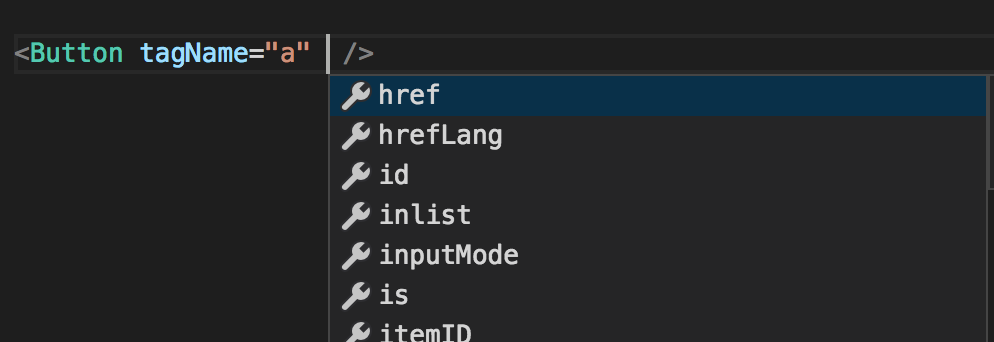

When designing a React component for reusability, you often quickly run into the need to pass different arbitrary DOM attributes to the component’s container in different situations. Let’s say you’re building a `<Button />`. Maybe at first, you just need to allow a custom `className` to be merged in, but eventually you need to support a wide range of attributes and event handlers that aren’t related to the component itself, but rather the context in which it’s used—say, `aria-describedby` when composed with a Tooltip component, or `tabIndex` and `onKeyDown` when contained in a component that manages focus with arrow keys.

It’s impossible for Button to predict and to handle every special context where it might be used, so there’s a reasonable argument for allowing arbitrary extra props to be passed to Button, and letting it pass extra ones it doesn’t understand through. (This consume-what-I-need-and-pass-the-rest-through pattern is quite common and well-understood, but isn’t the focus of this article.)

<!--@
  name: Button1.tsx
-->
```tsx
interface ButtonProps extends React.ButtonHTMLAttributes<HTMLButtonElement> {
  color?: ColorName;
  icon?: IconName;
}

function Button({ color, icon, className, children, ...props }: ButtonProps) {
  return (
    <button
      {...props}
      className={getClassName(color, className)}
    >
      <FlexContainer>
        {icon && <Icon name={icon} />}
        <div>{children}</div>
      </FlexContainer>
    </button>
  );
}
```

Awesome: we can now pass extra props to the underlying `<button>` element, and it’s perfectly type-checked too. Since the props type extends `React.ButtonHTMLAttributes`, we can pass only props that are actually valid to end up on a `<button>`:

<!--@
  name: Button1.tsx
-->
```tsx
<Button onKeyDown={({ currentTarget }) => { /* do something */ }} />
<Button foo="bar" /> // Correctly errors 👍🏽
```

## When passthrough isn’t enough
Half an hour after you send Button v1 to the product engineering team, they come back to you with a question: how do we use Button as a Link? They need it to be able to render as an internal react-router `Link` _or_ as an external link, a plain `HTMLAnchorElement`.

If we weren’t concerned about type safety, we could write this pretty easily in plain JavaScript:

<!--@
  name: Button2.jsx
-->
```tsx
function Button({
  color,
  icon,
  className,
  children,
  tagName: TagName,
  ...props
}) {
  return (
    <TagName
      {...props}
      className={getClassName(color, className)}
    >
      <FlexContainer>
        {icon && <Icon name={icon} />}
        <div>{children}</div>
      </FlexContainer>
    </TagName>
  );
}

Button.defaultProps = { tagName: 'button' };
```

This makes it trivial for a consumer to use whatever tag or component they like as the container:

<!--@
  name: Button2.jsx
-->
```tsx
<Button tagName="a" href="https://github.com">GitHub</Button>
<Button tagName={Link} to="/about">About</Button>
```

But, how do we type this correctly? Button’s props can no longer unconditionally extend `React.ButtonHTMLAttributes`, because the extra props might not be passed to a `<button>`.

_Fair warning: I’m going to go down a serious rabbit hole to explain several reasons why this doesn’t work well. If you’d rather just take my word for it, feel free to [jump ahead](#an-alternative-approach)._

<!--@@
  maxWidth: 307
  linkImagesToOriginal: false
  backgroundColor: transparent
  wrapperClassName: light-only
-->


<!--@@
  maxWidth: 307
  linkImagesToOriginal: false
  backgroundColor: transparent
  wrapperClassName: dark-only
-->


Let’s start with a slightly simpler case where we only need to allow `tagName` to be `'a'` or `'button'`. (I’ll also remove props and elements that aren’t relevant to the point for brevity.) This would be a reasonable attempt:

<!--@
  name: Button3.tsx
-->
```tsx
interface ButtonProps {
  tagName: 'a' | 'button';
}

function Button<P extends ButtonProps>({ tagName: TagName, ...props }: P & JSX.IntrinsicElements[P['tagName']]) {
  return <TagName {...props} />;
}

<Button tagName="a" href="/" />
```

The two immediate observations that arise are

1. It doesn’t compile—it tells us, in so many words, that the type of `props.ref` is not correct for the type of `TagName`.
2. Despite that, it _does_ kind of produce the results we want when `tagName` is inferred as a string literal type. We even get completions from `AnchorHTMLAttributes`:



However, a little more experimentation reveals that we’ve also effectively disabled excess property checking:

<!--@
  name: Button3.tsx
-->
```tsx
<button href="/" fakeProp={1} /> // correct errors 👍
<Button tagName="button" href="/" fakeProp={1} /> // no errors 👎
```

Every prop you put on Button will be inferred as a property of the type parameter `P`, which in turn becomes part of the props that are allowed. In other words, the set of allowed props always includes all the props you pass. The moment you add a prop, it becomes part of the very definition of what Button’s props should be. (In fact, you can witness this by hovering `Button` in the example above.) This is decidedly the opposite of how you intend to define React components.

### What’s the problem with `ref`?
If you’re not yet convinced to abandon this approach, or if you’re just curious why the above doesn’t compile cleanly, let’s go deeper down the rabbit hole. And before you implement a clever workaround with `Omit<typeof props, 'ref'>`, spoiler alert: `ref` isn’t the only problem; it’s just the _first_ problem. The rest of the problems are _every event handler prop_. (You can discover this, if you want, by going into the React typings and commenting out [the `ref` property](https://github.com/DefinitelyTyped/DefinitelyTyped/blob/86303f134e12cf701a3f3f5e24867c3559351ea2/types/react/index.d.ts#L97). The compiler error will remain, substituting `onCopy` where it previously said `ref`.)

So what do `ref` and `onCopy` have in common? They both have the general form `(param: T) => void` where `T` mentions the instance type of the DOM element rendered: `HTMLButtonElement` for buttons and `HTMLAnchorElement` for anchors, for example. If you want to call a _union_ of call signatures, you have to pass the _intersection_ of their parameter types to ensure that regardless of which function gets called at runtime, it receives a subtype of what it expects for its parameter. Easier shown than said:

<!--@
  name: union-signatures.ts
-->
```ts
function addOneToA(obj: { a: number }) {
  obj.a++;
}

function addOneToB(obj: { b: number }) {
  obj.b++;
}

// Let’s say we have a function that could be either
// of the ones declared above
declare var fn: typeof addOneToA | typeof addOneToB;

// The function might access a property 'a' or 'b'
// of whatever we pass, so intuitively, the object
// needs to define both those properties.
fn({ a: 0 });
fn({ b: 0 });
fn({ a: 0, b: 0 });
```

In this example, it should be easy to recognize that we have to pass `fn` an object with the type `{ a: number, b: number }`, which is the _intersection_ of `{ a: number }` and `{ b: number }`. The same thing is happening with `ref` and all the event handlers:

```ts
type Props1 = JSX.IntrinsicElements['a' | 'button'];

// Simplifies to...
type Props2 =
  | JSX.IntrinsicElements['a']
  | JSX.IntrinsicElements['button'];

// Which means ref is...
type Ref =
  | JSX.IntrinsicElements['a']['ref']
  | JSX.IntrinsicElements['button']['ref'];

// Which is a union of functions!
declare var ref: Ref;
// (Let’s ignore string refs)
if (typeof ref === 'function') {
  // So it wants `HTMLButtonElement & HTMLAnchorElement`
  ref!(new HTMLButtonElement());
  ref!(new HTMLAnchorElement());
}
```

So now we can see why, rather than requiring the _union_ of the parameter types, `HTMLAnchorElement | HTMLButtonElement`, `ref` requires the _intersection_: `HTMLAnchorElement & HTMLButtonElement`—a theoretically possible type, but not one that will occur in the wild of the DOM. And we know intuitively that if we have a React element that’s either an anchor or a button, the value passed to `ref` will be either be an `HTMLAnchorElement` or an `HTMLButtonElement`, so the function we provide for `ref` _should_ accept an `HTMLAnchorElement | HTMLButtonElement`. Ergo, back to our original component, we can see that `JSX.IntrinsicElements[P['tagName']]` legitimately allows unsafe types for callbacks when `P['tagName']` is a union, and that’s what the compiler is complaining about. The manifest example of an unsafe operation that could occur by ignoring this type error:

<!--@
  name: Button3.tsx
-->
```tsx
<Button
  tagName={'button' as 'a' | 'button'}
  ref={(x: HTMLAnchorElement) => x.href.toLowerCase()}
/>
```

### Let’s make props an intersection, then!

I think what makes this problem unintuitive is that you always expect `tagName` to instantiate as exactly one string literal type, not a union. And in that case, `JSX.IntrinsicElements[P['tagName']]` is sound. Nevertheless, inside the component function, `TagName` looks like a union, so the props need to be typed as an intersection. As it turns out, it this [is possible](https://stackoverflow.com/questions/50374908/transform-union-type-to-intersection-type), but it’s a bit of a hack. So much so, I’m not going even going to put `UnionToIntersection` down in writing here. Don’t try this at home:

<!--@
  name: Button4.tsx
-->
```tsx
interface ButtonProps {
  tagName: 'a' | 'button';
}

function Button<P extends ButtonProps>({
  tagName: TagName,
  ...props
}: P & UnionToIntersection<JSX.IntrinsicElements[P['tagName']]>) {
  return <TagName {...props} />;
}

<Button tagName="button" type="foo" /> // Correct error! 🎉
```

How about when `tagName` is a union?

<!--@
  name: Button4.tsx
-->
```tsx
<Button
  tagName={'button' as 'a' | 'button'}
  ref={(x: HTMLAnchorElement) => x.href.toLowerCase()} // 🎉
/>
```

Let’s not celebrate prematurely, though: we haven’t solved our effective lack of excess property checking, which is an unacceptable tradeoff.

### Getting excess property checking back

As we discovered earlier, the problem with excess property checking is that all of our props become part of the type parameter `P`. We need a type parameter in order to infer `tagName` as a string literal unit type instead of a large union, but maybe the rest of our props don’t need to be generic at all:

```tsx
interface ButtonProps<T extends 'a' | 'button'> {
  tagName: T;
}

function Button<T extends 'a' | 'button'>({
  tagName: TagName,
  ...props
}: ButtonProps<T> & UnionToIntersection<JSX.IntrinsicElements[T]>) {
  return <TagName {...props} />;
}
```

Uh-oh. What is this new and unusual error?

It comes from the combination of the generic `TagName` and React’s definition for [JSX.LibraryManagedAttributes](https://github.com/DefinitelyTyped/DefinitelyTyped/blob/e4a0d4f532b177fc800e8ade7f1b39e9879d4b3c/types/react/index.d.ts#L2817-L2821) as a [distributive conditional type](https://www.typescriptlang.org/docs/handbook/release-notes/typescript-2-8.html#distributive-conditional-types). TypeScript currently doesn’t allow _anything_ to be assigned to conditional type whose “checked type” (the bit before the `?`) is generic:

```ts
type AlwaysNumber<T> = T extends unknown ? number : number;

function fn<T>() {
  let x: AlwaysNumber<T> = 3;
}
```

Clearly, the declared type of `x` will always be `number`, and yet `3` isn’t assignable to it. The rationale is a conservative simplification guarding against cases where distributivity might change the resulting type:

```ts
// These types appear the same, since all `T` extend `unknown`...
type Keys<T> = keyof T;
type KeysConditional<T> = T extends unknown ? keyof T : never;

// They’re the same here...
type X1 = Keys<{ x: any, y: any }>;
type X2 = KeysConditional<{ x: any, y: any }>;

// But not here!
type Y1 = Keys<{ x: any } | { y: any }>;
type Y2 = KeysConditional<{ x: any } | { y: any }>;
```

Because of the distributivity demonstrated here, it’s often unsafe to assume anything about a generic conditional type before it’s instantiated.

### Distributivity schmistributivity, I’m gonna make it work
Ok, fine. Let’s say you work out a way around that assignability error, and you’re ready to replace `'a' | 'button'` with all `keyof JSX.IntrinsicElements`.

```tsx
interface ButtonProps<T extends keyof JSX.IntrinsicElements> {
  tagName: T;
}

function Button<T extends keyof JSX.IntrinsicElements>({
  tagName: TagName,
  ...props
}: ButtonProps<T> & UnionToIntersection<JSX.IntrinsicElements[T]>) {
  // @ts-ignore YOLO
  return <TagName {...props} />;
}

<Button tagName="a" href="/" />
``` 

…and, congratulations, you’ve crashed TypeScript 3.4! The constraint type `keyof JSX.IntrinsicElements` is a union type of 173 keys, and the type checker will instantiate generics with their constraints to ensure all possible instantiations are safe. So that means `ButtonProps<T>` is a union of 173 object types, and, suffice it to say that `UnionToIntersection<...>` is a nested conditional type wrapped in a conditional type, one of which distributes into another union of 173 types upon which type inference is then invoked. Long story short, you’ve just invented a button that cannot be reasoned about within Node’s default heap size. And we never even got around to supporting `<Button tagName={Link} />`!

TypeScript 3.5 _does_ handle this without crashing by deferring a lot of the work that was happening to simplify conditional types, but do you _really_ want to write components that are just waiting for the right moment to explode?

## An alternative approach
As we go back to the drawing board, let’s refresh on what we’re actually trying to accomplish. Our Button component should:

* be able to accept arbitrary props like `onKeyDown` and `aria-describedby`
* be able to render as a `button`, an `a` with an `href` prop, or a `Link` with a `to` prop
* ensure that the root element has all the props it requires, and none that it doesn’t support
* not crash TypeScript or bring your favorite code editor to a screeching halt

It turns out that we can accomplish all of these with a render prop. I propose naming it `renderContainer` and giving it a sensible default:

<!--@
  name: GoodButton.tsx
-->
```tsx
interface ButtonInjectedProps {
  className: string;
  children: JSX.Element;
}

interface ButtonProps {
  color?: ColorName;
  icon?: IconName;
  className?: string;
  renderContainer: (props: ButtonInjectedProps) => JSX.Element;
  children?: React.ReactChildren;
}

function Button({ color, icon, children, className, renderContainer }: ButtonProps) {
  return renderContainer({
    className: getClassName(color, className),
    children: (
      <FlexContainer>
        {icon && <Icon name={icon} />}
        <div>{children}</div>
      </FlexContainer>
    ),
  });
}

const defaultProps: Pick<ButtonProps, 'renderContainer'> = {
  renderContainer: props => <button {...props} />
};
Button.defaultProps = defaultProps;
```

Let’s try it out:

<!--@
  name: GoodButton.tsx
-->
```tsx
// Easy defaults
<Button />

// Renders a Link, enforces `to` prop set
<Button
  renderContainer={props => <Link {...props} to="/" />}
/>

// Renders an anchor, accepts `href` prop
<Button
  renderContainer={props => <a {...props} href="/" />}
/>

// Renders a button with `aria-describedby`
<Button
  renderContainer={props =>
    <button {...props} aria-describedby="tooltip-1" />}
/>
```

We completely defused the type bomb by getting rid of the 173-constituent union `keyof JSX.IntrinsicElements` while simultaneously allowing even more flexibility, _and_ we get perfect type safety. Mission accomplished. 🎉 

## The overwritten prop caveat
There’s a small cost to an API design like this. It’s fairly easy to make a mistake like this:

<!--@
  name: GoodButton.tsx
-->
```tsx
<Button
  color={ColorName.Blue}
  renderContainer={props =>
    <button {...props} className="my-custom-button" />}
/>
```

Oops. `{...props}` already included a  `className`, which was needed to make the Button look nice and be blue, and here we’ve completely overwritten that class with `my-custom-button`.

On one hand, this provides the ultimate degree of customizability—the consumer has total control over what does and doesn’t go onto the container, allowing for fine-grained customizations that weren’t possible before. But on the other hand, you probably wanted to merge those classes 99% of the time, and it might not be obvious why it appears visually broken in this case.

Depending on the complexity of the component, who your consumers are, and how solid your documentation is, this may or may not be a serious problem. When I started using patterns like this in my own work, I wrote a [small utility](https://github.com/andrewbranch/merge-props) to help with the ergonomics of merging injected and additional props:

<!--@
  name: GoodButton.tsx
-->
```tsx
<Button
  color={ColorName.Blue}
  renderContainer={props =>
    <button {...mergeProps(props, {
      className: 'my-custom-button',
      onKeyDown: () => console.log('keydown'),
    })} />}
/>
```

This ensures the class names are merged correctly, and if `ButtonInjectedProps` ever expands its definition to inject its own `onKeyDown`, both the injected one and the console-logging one provided here will be run.
